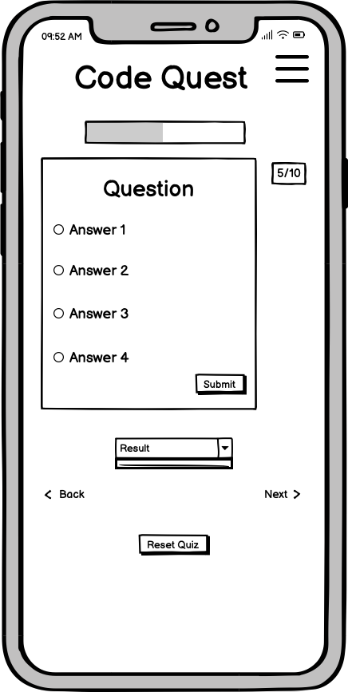
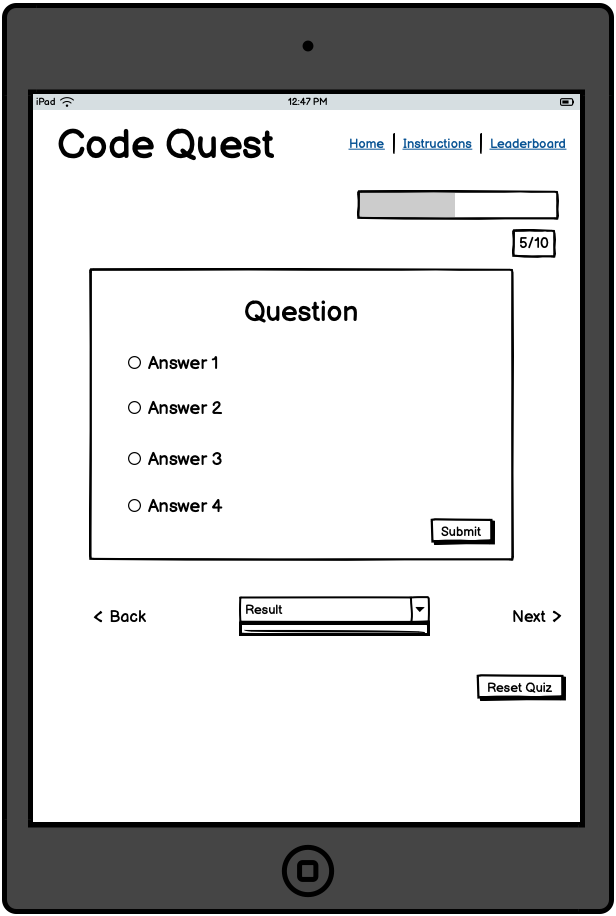
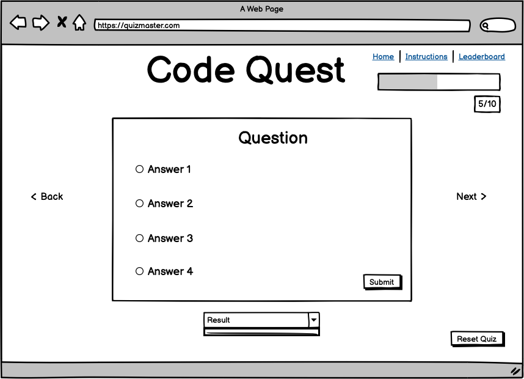

# Quiz Master

## Recent Updates

### Code Optimization & Bug Testing (Latest)
- **Condensed Instructions Code**: Reduced HTML content by 50% while maintaining functionality
- **Streamlined JavaScript**: Combined similar functions and removed redundant code  
- **Optimized CSS**: Merged duplicate styles and reduced file size
- **Comprehensive Bug Check**: Tested all functionality with no errors found
- **Enhanced Comments**: Added concise, descriptive comments to all new functions

### Instructions Page Implementation
- **Interactive Tutorial**: Comprehensive instructions with animated cards and smooth transitions
- **Smooth Navigation**: Fade animations when transitioning from instructions to quiz
- **Hover Effects**: Interactive cards with lift and rotation animations  
- **Direct Linking**: Support for URL hash linking to instructions section
- **Mobile Responsive**: Optimized layout for all screen sizes
- **Accessibility**: ARIA labels and semantic HTML structure

## Table Of Contents:
1. [Design & Planning](#design-&-planning)
    * [User Stories](#user-stories)
    * [Wireframes](#wireframes)
    * [Typography](#typography)
    * [Colour Scheme](#colour-scheme)

    
2. [Features](#features)
    * [Navigation](#Navigation)
    * [Footer](#Footer)
    * [Home page](#Home-page)
    * [Other features](#Other-features)

3. [Technologies Used](#technologies-used)
4. [Testing](#testing)
5. [Bugs](#bugs)
6. [Deployment](#deployment)
7. [Credits](#credits)

## Design & Planning:

### User Stories
| **Story Title**               | **User Story**                                                                                                                                         | **Acceptance Criteria**                                                                                                                                                                                                                                                                                                                                                          | **Tasks**                                                                                                                                                                                                                                                                                                                                                                                                                                                                                      | **Label**     |
|------------------------------|--------------------------------------------------------------------------------------------------------------------------------------------------------|-----------------------------------------------------------------------------------------------------------------------------------------------------------------------------------------------------------------------------------------------------------------------------------------------------------------------------------------------------------------------------------|------------------------------------------------------------------------------------------------------------------------------------------------------------------------------------------------------------------------------------------------------------------------------------------------------------------------------------------------------------------------------------------------------------------------------------------------------------------------------------------------|---------------|
| Simple "Start Quiz" Landing Page | As a visitor, I want to start a quiz easily from the homepage so that I can begin testing my knowledge without confusion.                            | - Homepage has a clear "Start Quiz" button. - Button leads directly to the quiz section.                                                                                                                                                                                                                                                                              | - Create a simple landing page for the user. - Implement a "start quiz" button which redirects the user to the main application.                                                                                                                                                                                                                                                                                                                                                   | must-have     |
| Consistent Layouts           | As a user, I want to have a consistent experience throughout the quiz so that my focus can remain on answering the questions correctly.               | - Ensure each question follows the same format. - Ensure each page has consistent styling throughout.                                                                                                                                                                                                                                                                 | - Create a "question" template which can be reused for each question. - Create stylings for homepage, quiz and results page which remain consistent throughout. - Ensure quiz layout is simple and easy to follow.                                                                                                                                                                                                                                                           | must-have     |
| Quiz Functionality           | As a quiz taker, I want to select an answer for each question so that I can test my knowledge.                                                        | - Multiple choice questions. - User can only select one answer per question.                                                                                                                                                                                                                                                                                          | - Implement quiz question using radio buttons. - Ensure radio buttons within each question are linked through a unique _name_ attribute.                                                                                                                                                                                                                                                                                                                                           | must-have     |
| Instant Feedback             | As a user, I want to immediately know if my answer is correct or not, so that I can learn as I go.                                                    | - Correct answers show a positive message/icon. - Incorrect answers show a supportive message/icon, with an explanation of the correct answer. - Optionally, include a relevant image to pair with the answer.                                                                                                                                                  | - Check the user's answer upon their input. - Display relevant message in a div below the question (including image if wanted). - Disable the radio buttons for the question upon user input to prevent cheating.                                                                                                                                                                                                                                                             | must-have     |
| Results Page                 | As a user, I want to see my final score at the end of the quiz so that I can know my overall performance.                                             | - Results page shows final score and percentage. - Includes a personalised message depending on the score (with username if implemented). - Encouragement or tips displayed (e.g. "Great Job!" or "Try again to improve!").                                                                                                                                     | - Calculate a percentage from the user's score and display both the fractional score and percentage on the page. - Have score breakpoints which display various message depending on what percentage the user got (e.g. "You managed to get a perfect score! Well done <username>!" if the user got 100%, or "Good try <username>! Try again now you've had some practice!" if they got less than 50%).                                          | must-have     |
| Usernames                    | As a user, I want to create a username before starting the quiz, so that my results feel personalised.                                                | - User is prompted to enter a username. - Username is displayed during the quiz. - Username is displayed on the results page.                                                                                                                                                                                                                                  | - Create a user input to allow the user to choose their own username. - Ensure username is saved within a variable throughout the duration of the quiz. - Display the username throughout the quiz page. - Display the username within the results page.                                                                                                                                                                                                              | should-have   |
| Score Tracking               | As a player, I want my score to update as I play so that I can see how well I'm doing in real time.                                                   | - Score counter is visible during the quiz. - Score updates automatically when an answer is submitted.                                                                                                                                                                                                                                                                | - Create a visible section within the page for the user's current score. - Upon answer submission, increment the score counter by 1 if answer is correct. - Display the score as "x/y" where "x" is the user's current score, and "y" is how many questions they have answered/how many questions there are total.                                                                                                               | should-have   |
| Exit/Play Again Functionality | As a user, I want the option to replay the quiz to improve my score, or exit the quiz if I am happy with my results.                                 | - End screen includes a "Play Again!" button. - Option to exit the quiz if the user is happy.                                                                                                                                                                                                                                   | - Implement an option to clear current quiz data and return the user back to question 1 if they choose to play again. - Ensure that the user's chosen username remains if they choose to play again. - Return user back to the homepage if they choose to exit the quiz.                                                                                                                                                                                                   | should-have   |
| Hints                        | As a user, I would like the option to have a hint for the question if I am struggling to recall the answer.                                           | - Allow the user to access a hint if they want to. - Keep the hint hidden if the user does not actively choose to view it. - Optional: include a limited number of hints.                                                                                                                                                                                      | - Include a "Hints" dropdown on the page for the user to interact with. - Include a pop-up to ensure the user wants to access the hint to prevent accidental interactions. - Optional: keep a "hints" tracker that displays how many hints the user has remaining for the quiz.                                                                                                                                                       | could-have    |
| Varied Difficulties          | As a user, I would like to have the option to play the quiz at different difficulties to give me a step-up once I am comfortable with the questions. | - Have an easy/medium/hard mode available. - Each mode should have a different difficulty to the questions included. - Optional: No. of hints available should reduce on harder difficulties, if hints implemented.                                                                                                                                            | - Include difficulty options for the user on the homepage. - The set of questions which the user is required to answer changes dependent upon the selected difficulty. - Optional: reduce the number of hints available to the user on harder difficulties, if hints implemented.                                                                                                                                                     | could-have    |

### Wireframes

 
 

### Typography
We decided to go for a futuristic aesthetic for the font as the topic of our quiz is coding related. Tektur was the selected font.

### Colour Scheme
Screenshoot of the colour scheme for your project

## Features:
The Quiz App includes several key features designed to provide an engaging and educational experience:

### Navigation
- **Responsive Navigation Bar**: Clean navigation with mobile-friendly hamburger menu
- **Smooth Transitions**: CSS animations for seamless user experience
- **Accessibility Features**: ARIA labels and proper semantic HTML structure

### Instructions Page
- **Comprehensive How-to Guide**: Detailed instructions accessible via navigation menu or homepage link
- **Interactive Cards**: Four main instruction categories with hover effects:
  - **Question Format**: Multiple choice questions covering HTML, CSS, JavaScript
  - **Time & Scoring**: No time limits, +1 point per correct answer, percentage-based results
  - **How to Play**: Step-by-step gameplay instructions with navigation tips
  - **Leaderboard**: Username requirements and competitive features
- **Pro Tips Section**: Success strategies with visual icons and animations
- **Smooth Scrolling**: JavaScript-powered smooth navigation to quiz section
- **Responsive Design**: Mobile-optimized layout with touch-friendly interactions

### Quiz Functionality
- **Random Question Selection**: Questions presented in random order for each quiz attempt
- **Progress Tracking**: Visual progress bar and score counter
- **Answer Validation**: Immediate feedback with correct/incorrect styling
- **Explanation System**: Detailed explanations for each question after answering
- **Reset Functionality**: Option to restart quiz at any time

### Homepage
- **Username Entry**: Personalized experience with username storage
- **Quick Access Links**: Direct links to instructions, quiz, and leaderboard
- **Responsive Design**: Mobile-first approach with Bootstrap framework

### Results & Leaderboard
- **Detailed Results**: Final score, percentage, and performance breakdown
- **Leaderboard Integration**: Score saving and ranking system
- **Personalized Messages**: Dynamic feedback based on performance

### Other features
- **Local Storage**: Persistent data storage for usernames and scores
- **Accessibility**: Screen reader support and keyboard navigation
- **Cross-browser Compatibility**: Works across modern browsers
- **Mobile Responsive**: Optimized for all device sizes
## Technologies Used
List of technologies used for your project...
HTML
CSS
Bootstrap
Github
## Testing
Important part of your README!!!
### Google's Lighthouse Performance
Screenshots of certain pages and scores (mobile and desktop)
### Browser Compatibility
Check compatability with different browsers
### Responsiveness
Screenshots of the responsivness, pick few devices (from 320px top 1200px)
### Code Validation
Validate your code HTML, CSS (all pages/files need to be validated!!!), display screenshots
### Manual Testing user stories or/and features
Test all your user stories, you an create table 
User Story |  Test | Pass
--- | --- | :---:
paste here you user story | what is visible to the user and what action they should perform | &check;
- and attach screenshot

## Bugs
List of bugs and how did you fix them

## Deployment

#### Creating Repository on GitHub

- First make sure you are signed into [Github](https://github.com/).
- Then click on **Create a new repository** from the drop-down. Enter the name for the repository and click **Create repository from template**.
- Once the repository was created, I cloned the repository to my **VSCode** so that I could start working on it.

#### Deloying on Github

The site was deployed to Github Pages using the following method:

- Go to the Github repository.
- Navigate to the 'settings' tab.
- Using the 'select branch' dropdown menu, choose 'main'.
- Click 'save'.

The deployment page can be found [here](https://egg3552.github.io/quiz-hackathon-project/).

## AI Use
- Throughout the project, AI has been used to help with the creation of the site.
- One of the main uses of AI for the site was to get around bootstrap's built in stylings and scripts, to get the site to respond in the way we had designed it (e.g. implementing custom scripts on the carousel controls.).
- AI was also useful for restructuring the code when we realised that certain parts of one function had been written up in a different function, and so for clean code and readability reasons, we had it restructured.
- When GitHub pages had trouble deploying our page, AI suggested to create the .nojekyll file to help prevent errors.

## Credits
List of used resources for your website (text, images, snippets of code, projects....)
  - Code & Text Content
  
  - Media
  
  - Acknowledgment

